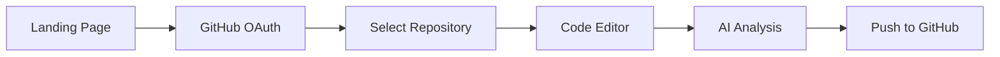

# 🚀 CodeAtEase - AI-Powered Code Editor


> **CodeAtEase** is an AI-powered web-based code editor that integrates seamlessly with GitHub. Edit your repositories with real-time AI assistance, all in a sleek black & white interface.

---

## ✨ Features

- 🔐 **GitHub OAuth Authentication** - Secure login with your GitHub account
- 📂 **Dynamic Repository Loading** - Access all your GitHub repositories in real-time
- 🎨 **Modern Black & White UI** - Clean, distraction-free interface
- 🤖 **AI Code Analysis** - Powered by DeepSeek AI model
- ✏️ **Live Code Editing** - Edit files with syntax highlighting
- 🔄 **GitHub Integration** - Push changes directly to GitHub
- 🔍 **Repository Search** - Quick search across all repositories
- 📊 **Repository Stats** - View stars, forks, language, and more
- 🎯 **Context-Aware AI** - AI analyzes your entire repository for better suggestions

---

## 🎬 Demo

### Step 1: Login with GitHub


### Step 2: Select Repository


### Step 3: AI-Powered Editing


---

## 🛠️ Tech Stack

### Backend
- **FastAPI** - High-performance async web framework
- **Python 3.11+** - Modern Python features
- **JWT** - Secure token-based authentication
- **httpx** - Async HTTP client for GitHub API
- **Hugging Face** - AI model integration

### Frontend
- **HTML5** - Semantic markup
- **Tailwind CSS** - Utility-first styling
- **Vanilla JavaScript** - No heavy frameworks
- **Toastr** - Elegant notifications

### APIs & Services
- **GitHub API** - Repository management
- **GitHub OAuth** - User authentication
- **Hugging Face Inference API** - AI code analysis

---

## 📦 Installation

### Prerequisites

- Python 3.11 or higher
- GitHub account
- Hugging Face account (free)

### 1. Clone Repository

```bash
git clone https://github.com/yourusername/CodeAtEase.git
cd CodeAtEase
```

### 2. Create Virtual Environment

```bash
python -m venv venv

# On Windows
venv\Scripts\activate

# On macOS/Linux
source venv/bin/activate
```

### 3. Install Dependencies

```bash
pip install -r requirements.txt
```

### 4. Set Up Environment Variables

Create a `.env` file in the root directory:

```env
# Secret Key (generate with: openssl rand -hex 32)
SECRET_KEY=your-secret-key-here-change-in-production
ALGORITHM=HS256

# GitHub OAuth App Credentials
GITHUB_CLIENT_ID=your_github_client_id
GITHUB_CLIENT_SECRET=your_github_client_secret
GITHUB_REDIRECT_URI=http://127.0.0.1:8000/auth/github/callback

# Hugging Face Token
HF_TOKEN=your_hugging_face_token
```

### 5. Create Templates Folder

```bash
mkdir templates
```

### 6. Move HTML Files

Move your HTML files to the templates folder:
- `index.html` → Login page
- `repo.html` → Repository selection page
- `aipage.html` → Code editor page

---

## 🔑 Getting API Keys

### GitHub OAuth App

1. Go to [GitHub Developer Settings](https://github.com/settings/developers)
2. Click **"New OAuth App"**
3. Fill in the details:
   - **Application name**: CodeAtEase
   - **Homepage URL**: `http://127.0.0.1:8000`
   - **Authorization callback URL**: `http://127.0.0.1:8000/auth/github/callback`
4. Click **"Register application"**
5. Copy the **Client ID** and **Client Secret** to your `.env` file

### Hugging Face Token

1. Go to [Hugging Face Settings](https://huggingface.co/settings/tokens)
2. Click **"New token"**
3. Give it a name (e.g., "CodeAtEase")
4. Select **"Read"** permission
5. Click **"Generate"**
6. Copy the token to your `.env` file

---

## 🚀 Running the Application

### Development Mode

```bash
uvicorn app:app --reload --port 8000
```

### Production Mode

```bash
uvicorn app:app --host 0.0.0.0 --port 8000
```

### Access the Application

Open your browser and navigate to:
```
http://127.0.0.1:8000
```

---

## 📂 Project Structure

```
CodeAtEase/
│
├── app.py                      # FastAPI application
├── requirements.txt            # Python dependencies
├── .env                        # Environment variables (don't commit!)
├── .gitignore                 # Git ignore file
│
├── templates/                 # HTML templates
│   ├── index.html            # Login page (Step 1)
│   ├── repo.html             # Repository selection (Step 2)
│   └── aipage.html           # Code editor (Step 3)
│
└── README.md                  # This file
```

---

## 🔄 User Flow



1. **Login** - Authenticate with GitHub OAuth
2. **Select Repository** - Choose from your GitHub repositories
3. **Edit Code** - Make changes with AI assistance
4. **Analyze** - Get AI-powered code suggestions
5. **Push** - Commit changes back to GitHub

---

## 🎯 API Endpoints

### Authentication
- `GET /` - Landing page
- `GET /auth/github` - Redirect to GitHub OAuth
- `GET /auth/github/callback` - Handle OAuth callback
- `GET /auth/user` - Get current user info
- `POST /auth/logout` - Logout user

### Repository Management
- `GET /repo.html` - Repository selection page
- `GET /api/repositories` - List all user repositories
- `GET /api/repository/{owner}/{repo}/contents` - Get repository file structure
- `GET /api/repository/{owner}/{repo}/file` - Get file content
- `PUT /api/repository/{owner}/{repo}/file` - Update file content

### File Operations
- `POST /api/file/create` - Create new file
- `DELETE /api/file/delete` - Delete file

### AI Analysis
- `POST /api/analyze` - Analyze code with AI
- `GET /ai` - Code editor page

### Health Check
- `GET /health` - API health status

---

## 🤖 AI Features

### Code Analysis
- **Bug Detection** - Identifies potential bugs and issues
- **Best Practices** - Suggests improvements based on coding standards
- **Code Optimization** - Recommends performance improvements
- **Context-Aware** - Analyzes code in the context of the entire repository

### Supported Languages
- JavaScript/TypeScript
- Python
- Java
- C/C++
- Go
- Rust
- Ruby
- PHP
- And more...

---

## 🎨 Design Philosophy

### Black & White Theme
- **Minimalist** - Focus on code, not colors
- **High Contrast** - Easy on the eyes
- **Professional** - Clean and modern look
- **Distraction-Free** - No unnecessary elements

### Responsive Design
- Desktop-first approach
- Adapts to different screen sizes
- Touch-friendly interface

---

## 🔒 Security Features

- ✅ JWT token-based authentication
- ✅ Secure GitHub OAuth flow
- ✅ Server-side token storage
- ✅ HTTPS support (in production)
- ✅ CORS protection
- ✅ Input validation with Pydantic
- ✅ Password hashing with bcrypt

---

## 📊 Performance

- **Fast API Response** - Built on FastAPI (one of the fastest Python frameworks)
- **Async Operations** - Non-blocking I/O for better performance
- **Connection Pooling** - Reuses HTTP connections
- **Lazy Loading** - Loads repository files on demand
- **Pagination Support** - Handles large repository lists efficiently

---

## 🐛 Troubleshooting

### Issue: "Failed to load repositories"
**Solution:**
- Verify GitHub OAuth app is created correctly
- Check `GITHUB_CLIENT_ID` and `GITHUB_CLIENT_SECRET` in `.env`
- Ensure callback URL matches: `http://127.0.0.1:8000/auth/github/callback`

### Issue: "Token expired"
**Solution:**
- Clear browser localStorage: `localStorage.clear()`
- Login again

### Issue: "Subject must be a string" error
**Solution:**
- Make sure you're using the latest version of `app.py`
- The JWT subject is now properly converted to string

### Issue: Port already in use
**Solution:**
```bash
# Find and kill process using port 8000
lsof -ti:8000 | xargs kill -9

# Or use a different port
uvicorn app:app --reload --port 8001
```

---

## 🤝 Contributing

Contributions are welcome! Please follow these steps:

1. Fork the repository
2. Create a feature branch (`git checkout -b feature/AmazingFeature`)
3. Commit your changes (`git commit -m 'Add some AmazingFeature'`)
4. Push to the branch (`git push origin feature/AmazingFeature`)
5. Open a Pull Request

---

## 📝 Requirements

```txt
fastapi==0.109.0
uvicorn[standard]==0.27.0
httpx==0.26.0
python-jose[cryptography]==3.3.0
passlib[bcrypt]==1.7.4
python-multipart==0.0.6
python-dotenv==1.0.0
huggingface-hub==0.20.0
jinja2==3.1.2
```

---

## 🗺️ Roadmap

- [ ] **Multi-language Support** - Support for more programming languages
- [ ] **Collaborative Editing** - Real-time collaboration features
- [ ] **Dark Theme** - Alternative dark color scheme
- [ ] **Mobile App** - Native mobile applications
- [ ] **VS Code Extension** - Integrate with VS Code
- [ ] **Advanced AI Models** - Support for GPT-4, Claude, etc.
- [ ] **Git History** - View commit history and diffs
- [ ] **Branch Management** - Create and switch branches
- [ ] **Pull Request Integration** - Create PRs from the editor
- [ ] **Code Review** - AI-powered code reviews

---

## 📄 License

This project is licensed under the MIT License - see the [LICENSE](LICENSE) file for details.

```
MIT License

Copyright (c) 2025 Muralimithun CS

Permission is hereby granted, free of charge, to any person obtaining a copy
of this software and associated documentation files (the "Software"), to deal
in the Software without restriction, including without limitation the rights
to use, copy, modify, merge, publish, distribute, sublicense, and/or sell
copies of the Software, and to permit persons to whom the Software is
furnished to do so, subject to the following conditions:

The above copyright notice and this permission notice shall be included in all
copies or substantial portions of the Software.

THE SOFTWARE IS PROVIDED "AS IS", WITHOUT WARRANTY OF ANY KIND, EXPRESS OR
IMPLIED, INCLUDING BUT NOT LIMITED TO THE WARRANTIES OF MERCHANTABILITY,
FITNESS FOR A PARTICULAR PURPOSE AND NONINFRINGEMENT. IN NO EVENT SHALL THE
AUTHORS OR COPYRIGHT HOLDERS BE LIABLE FOR ANY CLAIM, DAMAGES OR OTHER
LIABILITY, WHETHER IN AN ACTION OF CONTRACT, TORT OR OTHERWISE, ARISING FROM,
OUT OF OR IN CONNECTION WITH THE SOFTWARE OR THE USE OR OTHER DEALINGS IN THE
SOFTWARE.
```

---

## 👨‍💻 Author

**Muralimithun CS**

- GitHub: [@yourusername](https://github.com/yourusername)
- Email: your.email@example.com
- LinkedIn: [Your LinkedIn](https://linkedin.com/in/yourprofile)

---

## 🙏 Acknowledgments

- [FastAPI](https://fastapi.tiangolo.com/) - Modern web framework
- [GitHub](https://github.com) - Repository hosting and OAuth
- [Hugging Face](https://huggingface.co/) - AI model hosting
- [Tailwind CSS](https://tailwindcss.com/) - Utility-first CSS framework
- [Toastr](https://github.com/CodeSeven/toastr) - Notification library

---

## 💡 Inspiration

CodeAtEase was built to bridge the gap between traditional code editors and AI-powered development tools. Our goal is to make coding more accessible and efficient with intelligent assistance.

---

## 📞 Support

If you encounter any issues or have questions:

1. Check the [Troubleshooting](#-troubleshooting) section
2. Open an [Issue](https://github.com/yourusername/CodeAtEase/issues)
3. Join our [Discord Community](https://discord.gg/your-invite-link)

---

## ⭐ Show Your Support

If you find this project useful, please consider:

- ⭐ Starring the repository
- 🐛 Reporting bugs
- 💡 Suggesting new features
- 🤝 Contributing to the code
- 📢 Sharing with others

---

<div align="center">

### 🤍 Crafted with love by Muralimithun CS

**[⬆ Back to Top](#-codeatease---ai-powered-code-editor)**

</div>
